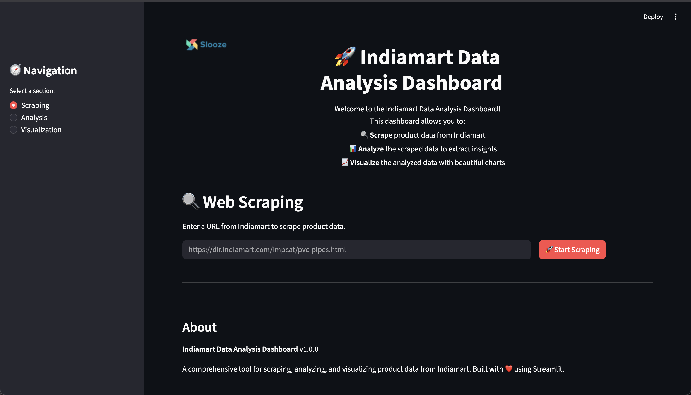
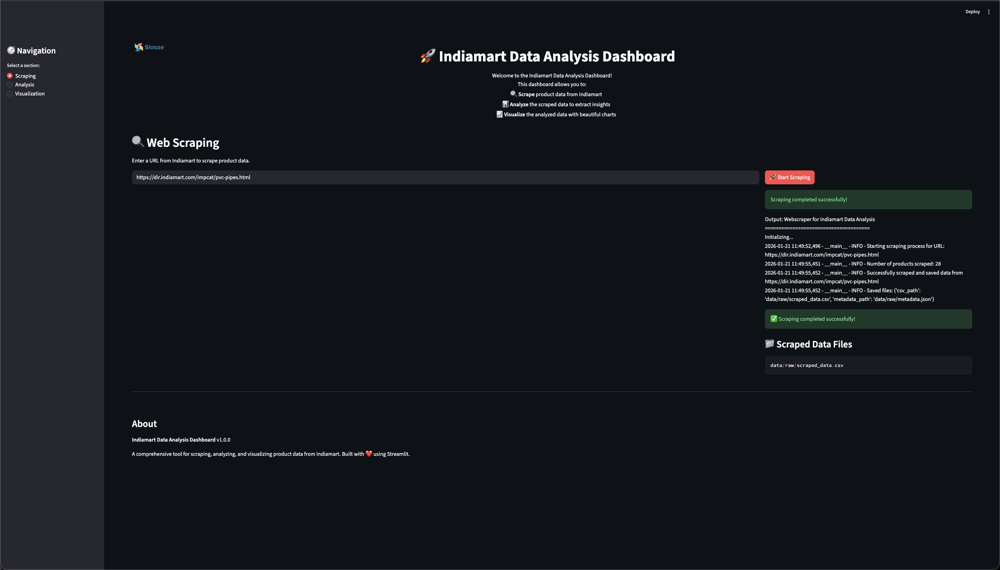
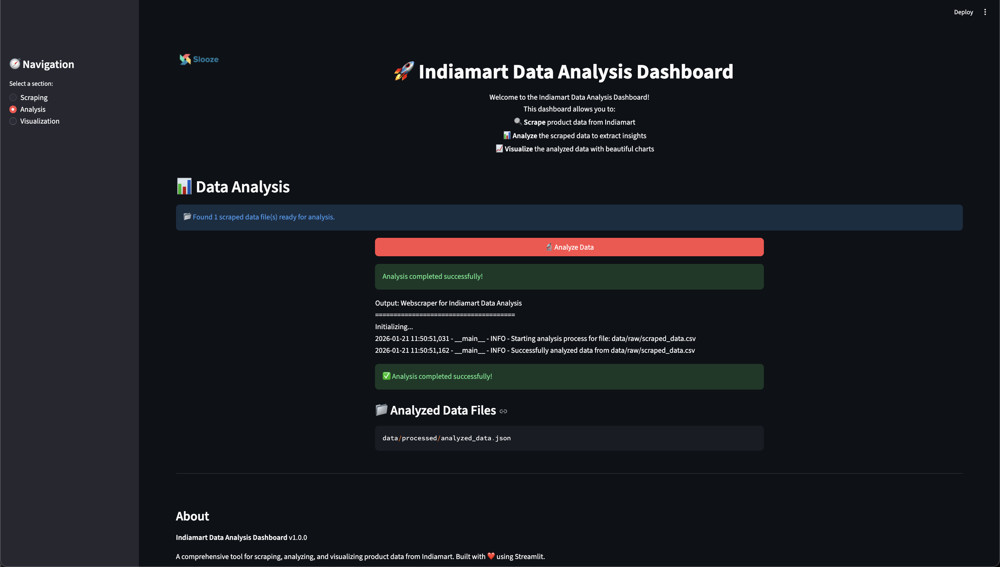

# 🚀 Web Scraper for Indiamart Data Analysis

[](https://www.python.org/downloads/)
[](https://opensource.org/licenses/MIT)
[](https://streamlit.io/)

<div align="center">
  
  <h3>A comprehensive, enterprise-grade web scraping and data analysis platform</h3>
  <p>Extract, analyze, and visualize market insights with advanced machine learning and NLP capabilities</p>
</div>

## ✨ Key Features

### 🔍 **Advanced Web Scraping**
- Intelligent scraping of Indiamart product listings
- Handles dynamic content and anti-bot measures
- Configurable rate limiting and retry mechanisms
- Support for multiple product categories

### 📊 **Comprehensive Data Analysis**
- **Descriptive Statistics**: Mean, median, mode, standard deviation, quartiles
- **Price Intelligence**: Range analysis, trend detection, outlier identification
- **Market Segmentation**: Automatic product categorization with NLP
- **Seller Analytics**: Performance metrics, pricing strategies, market share
- **Text Mining**: Keyword extraction, sentiment analysis, feature detection
- **Correlation Analysis**: Statistical relationships between variables
- **Competitive Intelligence**: Market positioning and pricing comparisons

### 📈 **Interactive Dashboard**
- Real-time metrics and KPIs
- Multiple visualization types (charts, tables, heatmaps)
- Tabbed interface for organized analysis
- Responsive design for all devices
- Export capabilities for reports

### 🤖 **Machine Learning & AI**
- Product clustering for market segmentation
- Sentiment analysis of product descriptions
- Outlier detection for data quality
- Trend analysis and forecasting

## 🏗️ Architecture

```
Web Scraper for Indiamart Data Analysis
├── 🎯 Scraping Layer
│   ├── Intelligent URL discovery
│   ├── Anti-detection measures
│   └── Structured data extraction
├── 🔧 Processing Pipeline
│   ├── Data cleaning & validation
│   ├── Feature engineering
│   └── Quality assurance
├── 🧠 Analysis Engine
│   ├── Statistical analysis
│   ├── ML model inference
│   └── NLP processing
└── 📊 Visualization Layer
    ├── Interactive dashboards
    ├── Real-time metrics
    └── Export functionality
```

## 📁 Project Structure

```
web-scraper-project/
├── src/
│   ├── main.py                      # CLI entry point
│   ├── models/
│   │   ├── product.py              # Product data model
│   │   ├── scraped_data.py         # Scraped data container
│   │   └── analyzed_data.py        # Analysis results model
│   ├── scraper/
│   │   ├── indiamart_scraper.py    # Core scraping logic
│   │   └── data_storage.py         # Data persistence layer
│   ├── analyzer/
│   │   ├── data_cleaner.py         # Data preprocessing
│   │   └── data_analyzer.py        # Advanced analytics
│   └── visualizer/
│       ├── dashboard.py            # Streamlit dashboard
│       └── plot_generator.py       # Chart generation
├── tests/
│   ├── unit/                       # Unit test suites
│   └── integration/                # Integration tests
├── data/                           # Data directories (auto-created)
├── requirements.txt                # Python dependencies
├── .gitignore                      # Git ignore rules
└── README.md                       # This file
```

## 🚀 Quick Start

### Prerequisites

- **Python**: 3.8 or higher
- **RAM**: Minimum 4GB (8GB recommended for large datasets)
- **Storage**: 2GB free space for data and models

### Installation

1. **Clone the repository**
   ```bash
   git clone https://github.com/yourusername/web-scraper-project.git
   cd web-scraper-project
   ```

2. **Create virtual environment**
   ```bash
   python -m venv venv
   source venv/bin/activate  # Windows: venv\Scripts\activate
   ```

3. **Install dependencies**
   ```bash
   pip install -r requirements.txt
   ```

4. **Download NLTK data** (required for text analysis)
   ```bash
   python -c "import nltk; nltk.download('punkt_tab'); nltk.download('stopwords')"
   ```

## 💡 Usage Guide

### 1. **Scrape Product Data**

```bash
# Scrape PVC pipes category
python src/main.py scrape --url "https://dir.indiamart.com/impcat/pvc-pipes.html"

# Scrape with custom output directory
python src/main.py scrape --url "https://dir.indiamart.com/impcat/steel-pipes.html" --output "data/custom"
```

**Supported URL formats:**
- `https://dir.indiamart.com/impcat/[category].html`
- `https://www.indiamart.com/[product-page].html`

### 2. **Analyze Scraped Data**

```bash
# Analyze the latest scraped data
python src/main.py analyze --input data/raw/scraped_data.csv

# Analyze specific file with custom output
python src/main.py analyze --input data/raw/custom_data.csv --output data/custom_analysis
```

**Analysis includes:**
- ✅ Price distribution and statistics
- ✅ Product categorization
- ✅ Seller performance metrics
- ✅ Market trend identification
- ✅ Competitive analysis
- ✅ Data quality assessment

### 3. **Launch Interactive Dashboard**

```bash
# Start dashboard with analyzed data
python src/main.py dashboard --input data/processed/analyzed_data.json

# Dashboard without pre-loaded data
python src/main.py dashboard
```

**Dashboard Features:**
- 📊 **Executive Summary**: Key metrics and KPIs
- 💰 **Price Analysis**: Distribution, ranges, top products
- 🏪 **Seller Analysis**: Performance, pricing strategies
- 📂 **Category Analysis**: Market segmentation, keywords
- 📋 **Data Quality**: Completeness, validation metrics

## 📸 Screenshots

### 🏠 Dashboard Home Page
<div align="center">
  
  <p><em>Welcome screen with navigation options and feature overview</em></p>
</div>

### 🔍 Data Scraping Interface
<div align="center">
  
  <p><em>Web scraping control panel with URL input, progress tracking, and status updates</em></p>
</div>

### 📊 Data Analysis Engine
<div align="center">
  
  <p><em>Analysis workflow showing data processing, cleaning, and insight generation</em></p>
</div>

### 📈 Interactive Data Visualizer
<div align="center">
  
  <p><em>Comprehensive analytics dashboard with price analysis, seller insights, and market trends</em></p>
</div>

## 🔧 Advanced Configuration

### Environment Variables

Create a `.env` file in the project root:

```bash
# Scraping Configuration
SCRAPER_TIMEOUT=30
SCRAPER_RETRIES=3
SCRAPER_DELAY=2
USER_AGENT_ROTATION=true

# Analysis Configuration
MAX_CLUSTERS=5
NLP_MODEL=en_core_web_sm
SENTIMENT_THRESHOLD=0.1

# Dashboard Configuration
DASHBOARD_PORT=8501
DASHBOARD_THEME=dark

# Logging
LOG_LEVEL=INFO
LOG_FILE=logs/scraper.log
```

### Custom Analysis Parameters

Modify analysis settings in `src/analyzer/data_analyzer.py`:

```python
# Clustering configuration
N_CLUSTERS = 5
RANDOM_STATE = 42

# Outlier detection
IQR_MULTIPLIER = 1.5

# Text analysis
MIN_KEYWORD_LENGTH = 3
MAX_KEYWORDS = 20
```

## 🧪 Testing

### Run Test Suite

```bash
# All tests
pytest

# Unit tests only
pytest tests/unit/

# Integration tests
pytest tests/integration/

# With coverage report
pytest --cov=src --cov-report=html tests/
```

### Test Specific Components

```bash
# Test scraper functionality
pytest tests/unit/test_scraper.py -v

# Test analyzer
pytest tests/unit/test_analyzer.py -v

# Test dashboard
pytest tests/unit/test_dashboard.py -v
```

## 🔍 Analysis Capabilities

### 📈 Price Intelligence
- Statistical distribution analysis
- Price range segmentation (budget/mid/premium)
- Trend detection and forecasting
- Outlier identification
- Competitive pricing analysis

### 🏷️ Product Categorization
- Automatic classification using NLP
- Custom keyword dictionaries
- Category-specific pricing analysis
- Market share calculations

### 👥 Seller Analytics
- Performance ranking by product count
- Pricing strategy analysis
- Geographic distribution
- Market concentration metrics

### 💬 Text & Sentiment Analysis
- Keyword extraction from descriptions
- Feature identification
- Sentiment scoring
- Trend detection in product descriptions

### 🔗 Correlation & Relationships
- Statistical correlation analysis
- Feature relationship mapping
- Predictive factor identification
- Market dependency analysis

### 🎯 Data Quality Assurance
- Completeness scoring
- Duplicate detection
- Missing value analysis
- Data validation rules

## 🐛 Troubleshooting

### Common Issues

**1. Import Errors**
```bash
# Ensure virtual environment is activated
source venv/bin/activate

# Reinstall dependencies
pip install -r requirements.txt
```

**2. Scraping Failures**
```bash
# Check internet connection
ping www.indiamart.com

# Verify URL format
curl -I "https://dir.indiamart.com/impcat/pvc-pipes.html"

# Increase timeout in .env
SCRAPER_TIMEOUT=60
```

**3. Memory Issues**
```bash
# For large datasets, increase system memory
# Or process data in chunks
python src/main.py analyze --input large_dataset.csv --chunk-size 1000
```

**4. NLTK Data Errors**
```bash
python -c "import nltk; nltk.download('punkt_tab'); nltk.download('stopwords')"
```

### Debug Mode

Enable detailed logging:
```bash
export LOG_LEVEL=DEBUG
python src/main.py scrape --url "https://example.com"
```


## 🗺️ Roadmap

### Phase 1 (Current)
- ✅ Indiamart scraping
- ✅ Basic data analysis
- ✅ Interactive dashboard
- ✅ Comprehensive analytics

### Phase 2 (Upcoming)
- 🔄 Multi-platform support (Alibaba, Amazon)
- 🔄 Scheduled scraping jobs
- 🔄 Advanced ML models
- 🔄 API endpoints
- 🔄 User authentication

### Phase 3 (Future)
- 🔄 Real-time price monitoring
- 🔄 Predictive analytics
- 🔄 Mobile app companion
- 🔄 Integration with business intelligence tools


## 🙏 Tech Used

- **Beautiful Soup** for HTML parsing
- **Streamlit** for dashboard framework
- **Scikit-learn** for machine learning
- **NLTK** for natural language processing
- **Plotly** for interactive visualizations

---

**Made with ❤️ for data-driven market intelligence**
