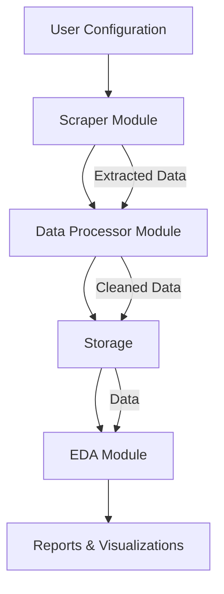
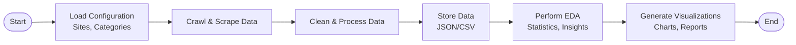

# Architecture Diagrams

## High-Level Architecture Diagram



## Data Flow Diagram



## Component Interaction Diagram

```mermaid
graph LR
    subgraph Scraper
        S1[Scrapy Spider] --> S2[Data Extraction]
        S2 --> S3[Rate Limiting]
    end
    subgraph Processor
        P1[Pandas Cleaning] --> P2[Data Validation]
        P2 --> P3[Standardization]
    end
    subgraph EDA
        E1[Statistics Calculation] --> E2[Visualization]
        E2 --> E3[Insight Generation]
    end

    Scraper --> Processor
    Processor --> EDA